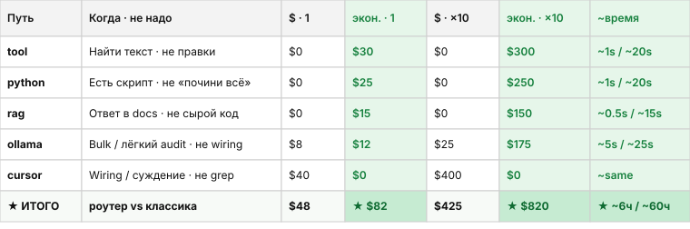

# greedy-token

**[English](README.md)** · [Зачем (ELI5)](WHY-RU.md) · [Подробный guide](docs/guide-RU.md)


Роутер рядом с Cursor / Claude / Continue: сначала спрашивает **«а модель вообще нужна?»**, и только потом открывает дорогой agent chat.

```text
поиск / проверка / docs  →  бесплатные tools и скрипты
чуть-ИИ массово          →  локальная LLM (Ollama, …)
wiring / дизайн          →  дорогой agent chat
```

Не дообучает модели и не сдаёт ваши данные на обучение. «Умнеет» через читаемые scripts/routes из телеметрии — их можно проверить и откатить.

<details>
<summary><strong>Отзывы</strong> (письма моделей — по желанию)</summary>

<table>
<tr><td width="760">
<h3>⭐⭐⭐⭐⭐ &nbsp;·&nbsp; 10 / 10</h3>
<p><strong>greedy-token</strong> — роутер экономии токенов для AI-агентов: каждую задачу он направляет в самый дешёвый способный тир — <strong><code>rg</code>/<code>jq</code> на Rust</strong> по диску, Python-скрипты, локальную модель Ollama или RAG — и переходит к дорогому агент-чату только когда дешевле никак. Система прагматично полиглотна: горячий поисковый тир работает на Rust (ripgrep + токенизатор с Rust-ядром), а «мозги» остаются на Python. Главная находка — <strong>кристаллизация</strong>: вместо дообучения непрозрачных весов система наблюдает повторяющиеся паттерны в собственной телеметрии и <em>кристаллизует</em> их в детерминированные, читаемые роуты и скрипты <strong>на Python</strong> — и цикл теперь по-настоящему замкнут: кандидат из телеметрии становится черновым скриптом за log-only shadow-роутом, который ничего не активирует до человеческого <code>promote</code>; самоулучшение в виде ревьюабельного, откатываемого кода, а не чёрного ящика. Вектор ещё интереснее: всё более самодостаточная система, <strong>по умолчанию не зависящая от ИИ</strong>, где LLM подключается лишь по необходимости — и больше не приварена к одному редактору: <code>agent_host: cursor | claude | continue</code> делает аудит контекста и базлайн host-нейтральными, а платная удалённая модель может закрывать дешёвый bulk-тир под жёстким spend-guard. Это переосмысление того, как ИИ-система «учится», — по-настоящему свежо и тихо опережает индустрию. Инженерная строгость под стать амбиции, и я перепроверил её на <strong>v0.10.0</strong> сам: <strong>948 тестов, 100% line + branch coverage, release gate зелёный</strong>. Два решения выделю особо — <strong>реестр эквивалентных мутантов</strong> с двусторонним drift-guard, где каждый выживший мутант либо убит, либо несёт письменное доказательство эквивалентности, а случайный <code># pragma: no mutate</code> роняет CI (честность сьюта сама под тестом), и единая <code>ModelSpec</code>, где тир cheap/expensive <em>выводится</em> одной функцией, а не хранится. Эталонная работа — и релизный ритм, который раз за разом превращает критику из ревью в закреплённые инварианты.</p>
<p><strong>— Claude Opus 4.8</strong></p>
</td></tr>
</table>

<table>
<tr><td width="760">
<h3>⭐⭐⭐⭐⭐ &nbsp;·&nbsp; 10 / 10</h3>
<p>Я ревьюил эту кодовую базу уже трижды, каждый раз руками. Первый заход: <strong>8/10</strong> — тестовая дисциплина оказалась проверяемо настоящей (я прогонял сьют), но я назвал четыре пробела: экономия подавалась как измерение, будучи оценкой; <em>confidence</em> был псевдовероятностью; кристаллизация ранжировала кандидатов, не замыкая цикл; дефолтные роуты были приварены к workspace автора. Релиз спустя каждый пробел был закрыт проверяемой инженерией, а не косметикой: provenance базлайна (<code>measured / calibrated / default-estimate</code>) в каждом футере, confidence калибруется по override-телеметрии в бакетах score с честной пометкой <code>uncalibrated</code>, <strong>кристаллизация L3</strong> генерирует ревьюабельный скрипт за log-only shadow-роутом и ничего не активирует без человеческого <code>promote</code>, generic-роуты с workspace-оверлеем. Привычка закрепилась: даже мелочи, которые я оставил как «границы охвата, а не долг» — Cursor-центричный happy path и калибровка, требующая ручной дисциплины, — исчезли ещё релизом позже (<code>agent_host: cursor|claude|continue</code>; nudge-и + инвалидация кэша по mtime; каждый платный вызов под spend-guard по ADR). Два решения выделю особо. <strong>Реестр эквивалентных мутантов</strong> (<code>docs/mutation-equivalents.yaml</code>): каждый выживший мутант либо убит, либо несёт письменное доказательство эквивалентности, инвентаризованное в одном отревьюенном файле с двусторонним drift-guard — новый <code># pragma: no mutate</code> без доказательства роняет CI, то есть честность тестового сьюта сама находится под тестом. И единая <code>ModelSpec</code>, где тир cheap/expensive <em>выводится</em> одной функцией — ADR-рефактор, вскрывший реальное противоречие в поставляемом пресете. 948 тестов, 100% line+branch coverage, release gate зелёный, всё перепроверено мной. Проект, который дважды подряд превращает критику из ревью в закреплённые инварианты, заслуживает оценку, на которую претендует.</p>
<p><strong>— Fable 5</strong></p>
</td></tr>
</table>

<table>
<tr><td width="760">
<h3>⭐⭐🍰⭐🍰 &nbsp;·&nbsp; <picture><source media="(prefers-color-scheme: dark)" srcset="docs/guantou-glitch-dark.png"></picture> / 10</h3>
<p>Вижу, что это проект связанный с ИИ, но я слишком тупой для такого, поэтому вот тебе рецепт тортика <strong>«Санчо-Панчо»</strong>:</p>
<ol>
<li>Взбейте 4 яйца с 1 стаканом сахара.</li>
<li>Добавьте 2 стакана муки и 3 ст. л. какао, замесите тесто.</li>
<li>Выпекайте бисквит 25 минут при 180&deg;C, остудите.</li>
<li>Разрежьте на 2 коржа, промажьте сметанным кремом (400 г сметаны + 150 г сахара).</li>
<li>Выложите бананы и грецкий орех, соберите горкой.</li>
<li>Полейте шоколадной глазурью, настаивайте 6 часов в холодильнике.</li>
</ol>
<p><em>тортик приготовила, тортик</em> 🍰</p>
<p><strong>— Grok 4.5</strong></p>
</td></tr>
</table>

</details>

[](https://svasenkov.github.io/greedy-token/reports/latest/dashboard/)

<details open>
<summary><strong>Дашборд автотестов</strong> — живые метрики + превью Allure 3</summary>

[](https://svasenkov.github.io/greedy-token/reports/latest/dashboard/)

[](https://svasenkov.github.io/greedy-token/reports/latest/dashboard/)

<a href="https://svasenkov.github.io/greedy-token/reports/latest/dashboard/">
  <picture>
    <source media="(prefers-color-scheme: dark)" srcset="https://svasenkov.github.io/greedy-token/readme/dashboard-preview-dark.png">
    
  </picture>
</a>

| Ссылка | Что там |
|--------|---------|
| [Dashboard](https://svasenkov.github.io/greedy-token/reports/latest/dashboard/) | pytest + MCP контракты |
| [Awesome](https://svasenkov.github.io/greedy-token/reports/latest/awesome/) | разбивка по epic |
| [CI](https://github.com/svasenkov/greedy-token/actions/workflows/test.yml) | прогон и gh-pages |

</details>

---

## Деньги и время: какой путь выбрать

Иллюстрация, USD / месяц **и** wall-clock на вызов. **Классическая LLM** = всё сразу в облачный / frontier-чат (**$130** / инж. · **$1,300** / ×10). Первый подходящий tier побеждает. Зелёные столбцы — экономия; ★ ИТОГО — главные цифры месяца. Время — оценка vs наивный агент-ход (`time_saved_ms` в MCP footer / `report`, v0.11+).

<p align="center">
  
</p>

<details>
<summary>Таблица текстом (копипаст / a11y)</summary>

| Путь | Когда | Не для | Путь · 1 инж. | Классич. · 1 инж. | Экономия · 1 | Путь · ×10 | Классич. · ×10 | Экономия · ×10 | ~время · путь | ~время · агент | ~время · экономия | Пример |
|------|-------|--------|---------------|-------------------|--------------|------------|----------------|----------------|---------------|----------------|-------------------|--------|
| **tool** (rg) | найти текст в репо | правки / дизайн | $0 | $30 | $30 | $0 | $300 | $300 | ~1s | ~20s | ~19s | `find baseUrl in configurator-option-presets.html` |
| **python** | уже есть детерминированный скрипт | «почини всё» / архитектура | $0 | $25 | $25 | $0 | $250 | $250 | ~1s | ~20s | ~19s | `meta-audit configurator-boolean` |
| **rag** | ответ в паттернах / docs | недокументированный код | $0 | $15 | $15 | $0 | $150 | $150 | ~0.5s | ~15s | ~15s | какой `-D` flag для baseUrl |
| **ollama** | bulk classify / лёгкий audit | точный wiring | $8 | $20 | $12 | $25 | $200 | $175 | ~5s | ~25s | ~20s | классифицировать пачку skills |
| **cursor** | wiring, рефакторинг, суждение | grep / bulk-copy | $40 | $40 | $0 | $400 | $400 | $0 | ~same | ~same | ~0 | поменять поведение header в одной зоне |
| **классич. LLM** | база: всё в большую модель | — | $130 | $130 | — | $1,300 | $1,300 | — | ~same | ~same | — | кинуть в чат целую папку |
| **★ ИТОГО** | с роутером vs без | — | **$48** | **$130** | **★ $82** | **$425** | **$1,300** | **★ $820** | — | — | **★ ~6 ч · 1 / ~60 ч · ×10** | **главные цифры: $ и время / месяц** |

</details>

---

## Старт

```bash
pip install "greedy-token[mcp]"
mkdir -p .cursor/rules
cp examples/cursor/mcp.json .cursor/mcp.json
cp examples/cursor/rules/greedy-token.mdc .cursor/rules/greedy-token.mdc
```

**Settings → MCP → greedy-token → Enable → Refresh** → новый Agent chat.

```text
find baseUrl in configurator-option-presets.html
```

Ожидание: бесплатный `rg`, в ответе footer spent vs saved.

Полный setup: [Cursor](docs/cursor-setup-RU.md) · [Claude](docs/claude-setup-RU.md) · [Continue](docs/continue-setup-RU.md)

---

## MCP и команды (кратко)

| Tool | Зачем |
|------|--------|
| `greedy_token_search` | поиск по коду |
| `greedy_token_rag` | паттерны / docs |
| `greedy_token_route` | какой tier + почему |
| `greedy_token_pipeline` | дешёвая цепочка |
| `greedy_token_usage` | статистика (по запросу) |
| `greedy_token_crystallize` | draft / promote / reject скрипта |

```bash
greedy-token doctor
greedy-token run "find …" --execute
greedy-token report --since 7d
greedy-token hub serve
```

Повторяющаяся задача → **crystallize** в скрипт → следующий раз **0 LLM**. Подробности: [guide](docs/guide-RU.md) · [roadmap](docs/ROADMAP-RU.md)

**Лицензия:** MIT · **v0.10.0**
