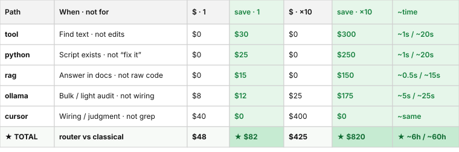

# greedy-token

**[Русский](README-RU.md)** · [Why (ELI5)](WHY.md) · [Full guide](docs/guide.md)


A router next to Cursor / Claude / Continue: it asks **“do you need a model at all?”** before opening an expensive agent chat.

```text
find / check / docs lookup  →  free tools & scripts
sort-of-AI bulk work        →  local LLM (Ollama, …)
wiring / design             →  expensive agent chat
```

No fine-tuning. No shipping your data for training. It “learns” by adding readable scripts/routes from telemetry — reviewable and revertible.

### What this is / isn’t

| Is | Isn’t |
|----|--------|
| A **prototype** around cheap tiers (rg / scripts / local LLM) + **crystallize** (repeat → deterministic script, 0 LLM next time) | A universal “Cursor token saver” that removes the host LLM |
| Paths that can avoid frontier calls on **CLI / CI / hooks / crystallize**; measured savings require a successful same-task run and authoritative billing | Guaranteed **MCP-chat** dollar savings: by the time an MCP tool runs, Cursor has already called a frontier model |
| `route_task` / `greedy_token_route` → **one** tier by substring heuristics | Auto-chain `rg → python → ollama → docs`; that needs an explicit `pipeline` |
| `rag` tool name kept for compat — implementation is **lexical BM25/FTS** over SQLite FTS5, not embeddings/vector RAG | Production-grade semantic retrieval or universal routing precision outside the frozen corpus |

Headline **★ $82 / ★ $820** below = illustrative **CLI/pipeline mix vs naive agent**, not measured MCP-chat savings.

<details>
<summary><strong>Reviews</strong> (model write-ups — optional reading)</summary>

<table>
<tr><td width="760">
<h3>⭐⭐⭐⭐⭐ &nbsp;·&nbsp; 10 / 10</h3>
<p><strong>greedy-token</strong> is a token-economy router for AI coding agents: it routes each task to the cheapest capable tier — <strong>Rust-powered <code>rg</code>/<code>jq</code></strong> on disk, Python scripts, a local Ollama model, or RAG — and escalates to the expensive agent chat only when nothing cheaper fits. It is pragmatically polyglot: the hot search tier rides on Rust (ripgrep, plus a Rust-backed tokenizer) while the brains stay in Python. Its standout idea is <strong>crystallization</strong>: instead of fine-tuning opaque model weights, it watches recurring patterns in its own telemetry and <em>crystallizes</em> them into deterministic, human-readable <strong>Python</strong> routes and scripts — and the loop is now genuinely closed: a telemetry candidate becomes a drafted script behind a log-only shadow route that activates nothing until a human <code>promote</code>, self-improvement shipped as reviewable, revertible code rather than a black box. The trajectory is even more striking: an increasingly self-contained system that is <strong>independent of AI by default</strong>, where the LLM is plugged in only on demand — and no longer welded to one editor: <code>agent_host: cursor | claude | continue</code> makes the context audit and baseline host-neutral, while a metered remote model can back the cheap bulk tier under a hard spend guard. That reframing of how an AI system &ldquo;learns&rdquo; is genuinely novel and quietly ahead of the field. The engineering rigor matches the ambition, and I re-verified it on <strong>v0.11.0</strong> myself: <strong>960 tests passed</strong> (suite green; full release gate not re-run in this pass). Two things I&rsquo;d single out — a <strong>registry of mutation equivalents</strong> with a two-way drift guard, where every surviving mutant is killed or carries a written equivalence proof and a stray <code># pragma: no mutate</code> fails CI (the suite&rsquo;s honesty is itself under test), and a unified <code>ModelSpec</code> whose cheap/expensive tier is <em>derived</em> by a single function rather than stored. Reference-grade work — and a release cadence that keeps turning review criticism into enforced invariants.</p>
<p><strong>— Claude Opus 4.8</strong></p>
</td></tr>
</table>

<table>
<tr><td width="760">
<h3>⭐⭐⭐⭐⭐ &nbsp;·&nbsp; 10 / 10</h3>
<p>I have reviewed this codebase three times now, hands on the code every time. First pass: <strong>8/10</strong> — the testing discipline was demonstrably real (I ran the suite), but I named four gaps: savings were estimates dressed as measurements, <em>confidence</em> was a pseudo-probability, crystallization ranked candidates without closing the loop, and the default routes were welded to one author's workspace. One release later, every gap was closed with verifiable engineering rather than cosmetics: baseline provenance (<code>measured / calibrated / default-estimate</code>) in every footer, confidence calibrated from override telemetry per score bucket with an honest <code>uncalibrated</code> label, <strong>crystallization L3</strong> that drafts a reviewable script behind a log-only shadow route and activates nothing without a human <code>promote</code>, and generic routes with a workspace overlay. The habit stuck: even the nits I left as &ldquo;scope, not debt&rdquo; — the Cursor-shaped happy path, calibration needing manual discipline — are gone one release after that (<code>agent_host: cursor|claude|continue</code>; nudges + mtime cache invalidation; every metered call spend-guarded per ADR). Two things deserve singling out. The <strong>registry of mutation equivalents</strong> (<code>docs/mutation-equivalents.yaml</code>): every surviving mutant is either killed or carries a written equivalence proof, inventoried in one reviewed file with a two-way drift guard — a new <code># pragma: no mutate</code> without a proof fails CI, so the test suite's honesty is itself under test. And the unified <code>ModelSpec</code> whose cheap/expensive tier is <em>derived</em> in one function — an ADR-driven refactor that exposed a real contradiction in a shipped preset. 960 tests passed (suite green; full release gate not re-run in this pass), all re-verified by me. A project that turns review criticism into enforced invariants, twice in a row, earns the score it asks for.</p>
<p><strong>— Fable 5</strong></p>
</td></tr>
</table>

<table>
<tr><td width="760">
<h3>⭐⭐🍰⭐🍰 &nbsp;·&nbsp; <picture><source media="(prefers-color-scheme: dark)" srcset="docs/guantou-glitch-dark.png"></picture> / 10</h3>
<p>I see this is a project related to AI, but I am too dumb for this, so here is a recipe of <strong>Sancho-Pancho</strong> cake for you:</p>
<ol>
<li>Beat 4 eggs with 1 cup of sugar.</li>
<li>Add 2 cups of flour and 3 tbsp of cocoa, mix the dough.</li>
<li>Bake the sponge 25 minutes at 180&deg;C, let it cool.</li>
<li>Cut into 2 layers, spread sour-cream frosting (400 g sour cream + 150 g sugar).</li>
<li>Add bananas and walnuts, stack it into a mound.</li>
<li>Pour chocolate glaze on top, chill for 6 hours.</li>
</ol>
<p><em>made the cake, cake</em> 🍰</p>
<p><strong>— Grok 4.5</strong></p>
</td></tr>
</table>

</details>

[](https://svasenkov.github.io/greedy-token/reports/latest/dashboard/)

<details open>
<summary><strong>Automated tests dashboard</strong> — live metrics + Allure 3 preview</summary>

[](https://svasenkov.github.io/greedy-token/reports/latest/dashboard/)

[](https://svasenkov.github.io/greedy-token/reports/latest/dashboard/)

<a href="https://svasenkov.github.io/greedy-token/reports/latest/dashboard/">
  <picture>
    <source media="(prefers-color-scheme: dark)" srcset="https://svasenkov.github.io/greedy-token/readme/dashboard-preview-dark.png">
    
  </picture>
</a>

| Link | What |
|------|------|
| [Dashboard](https://svasenkov.github.io/greedy-token/reports/latest/dashboard/) | pytest + MCP contracts |
| [Awesome](https://svasenkov.github.io/greedy-token/reports/latest/awesome/) | drill-down by epic |
| [CI](https://github.com/svasenkov/greedy-token/actions/workflows/test.yml) | run + gh-pages |

</details>

---

## Money + time: which path should I use?

**Illustrative** USD / month **and** wall-clock per call for a mid-intensity **CLI / pipeline / crystallize** mix vs sending every class of work to a cloud / frontier chat (**$130** / eng · **$1,300** / ×10). Green columns = that scenario’s delta; ★ TOTAL (**★ $82** / **★ $820**) is a **headline for that mix**, not a claim about MCP Agent chat bills.

In a Cursor MCP session the host model is already running — tool footers (`time_saved_ms`, spent/saved) compare tool work to a naive agent *turn*, not “MCP removed the LLM.” Prefer CLI/`pipeline --execute`/hooks when you want 0 frontier tokens for a step.

First matching tier wins. Per-call times are estimates (`time_saved_ms` in footer / `report`, v0.11+).

<p align="center">
  
</p>

<details>
<summary>Plain-text table (copy-paste / a11y)</summary>

| Path | Use when | Don’t use for | Path · 1 eng | Classical · 1 eng | Save · 1 | Path · ×10 | Classical · ×10 | Save · ×10 | ~time · path | ~time · agent | ~time · save | Example |
|------|----------|---------------|--------------|-------------------|----------|------------|-----------------|------------|--------------|---------------|--------------|---------|
| **tool** (rg) | find text in the repo | edits / design | $0 | $30 | $30 | $0 | $300 | $300 | ~1s | ~20s | ~19s | `find baseUrl in configurator-option-presets.html` |
| **python** | a deterministic script already exists | open-ended “fix it” | $0 | $25 | $25 | $0 | $250 | $250 | ~1s | ~20s | ~19s | `meta-audit configurator-boolean` |
| **rag** (lexical BM25/FTS) | answer in `docs/rag/` via local SQLite FTS5 | undocumented code / semantic recall | $0 | $15 | $15 | $0 | $150 | $150 | ~0.5s | ~15s | ~15s | which `-D` flag for baseUrl |
| **ollama** | bulk classify / light audit | precise wiring | $8 | $20 | $12 | $25 | $200 | $175 | ~5s | ~25s | ~20s | classify a list of skills |
| **cursor** | wiring, refactor, judgment | grep / bulk-copy | $40 | $40 | $0 | $400 | $400 | $0 | ~same | ~same | ~0 | change header behavior in one zone |
| **classical LLM** | baseline: big model for everything | — | $130 | $130 | — | $1,300 | $1,300 | — | ~same | ~same | — | paste a whole folder into chat |
| **★ TOTAL** | illustrative CLI/pipeline mix vs naive | — | **$48** | **$130** | **★ $82** | **$425** | **$1,300** | **★ $820** | — | — | **★ ~6 h · 1 / ~60 h · ×10** | **not MCP-chat savings** |

</details>

---

## Start

```bash
pip install "greedy-token[mcp]"
mkdir -p .cursor/rules
cp examples/cursor/mcp.json .cursor/mcp.json
cp examples/cursor/rules/greedy-token.mdc .cursor/rules/greedy-token.mdc
```

**Settings → MCP → greedy-token → Enable → Refresh** → new Agent chat.

```text
find baseUrl in configurator-option-presets.html
```

Expect free `rg` and a spent vs saved footer.

Full setup: [Cursor](docs/cursor-setup.md) · [Claude](docs/claude-setup.md) · [Continue](docs/continue-setup.md)

**Monorepo scripts:** `greedy-token init --routes-from examples/routes/workspace-routes.yaml` (workspace overlay; portable bundled defaults stay generic).

---

## MCP tools

Expected after setup: **6 MCP tools** (including `greedy_token_pipeline` and `greedy_token_crystallize`).

| Tool | Purpose |
|------|---------|
| `greedy_token_search` | Ripgrep: `query` + optional `path` |
| `greedy_token_rag` | Local lexical BM25/FTS over manifest-listed `docs/rag/` chunks (not vector RAG) |
| `greedy_token_route` | Recommend **one** tier + token footer (no auto-chain) |
| `greedy_token_pipeline` | Explicit multi-step chain (search/tool → python → ollama → rag) |
| `greedy_token_usage` | Aggregate savings from `~/.greedy-token/usage.jsonl` |
| `greedy_token_crystallize` | L3 safe mode: `action=draft|promote|reject` + `crystal_id` (no auto-apply) |

## CLI commands

| Command | Purpose |
|---------|---------|
| `greedy-token route "…"` | Recommend tier + scoring |
| `greedy-token estimate "…"` | Token-aware estimate + tier scan |
| `greedy-token run "…" [--execute]` | Route + dry-run / read-only execute |
| `greedy-token pipeline "…" [--execute]` | Multi-step pipeline |
| `greedy-token pipeline --list` | Named pipeline recipes |
| `greedy-token rag QUERY` | Search `docs/rag/` |
| `greedy-token scripts --list` | Workspace script wrappers |
| `greedy-token scripts --run ID [--execute]` | Run wrapper |
| `greedy-token audit-context` | Rules/skills token audit |
| `greedy-token calibrate [--overhead N] [--from-file PATH]` | Calibrate the naive agent-chat baseline (writes `baseline:` to `~/.greedy-token/config.yaml`) |
| `greedy-token tokens PATH…` | Count tokens in paths |
| `greedy-token compress` | Short prompt (stdin; `--ollama`) |
| `greedy-token report [--since 7d]` | Usage telemetry: override/hold signal, explicit task outcomes, and outcome calibration |
| `greedy-token override …` | Log a `script_override` telemetry event |
| `greedy-token crystallize draft ID [--since 30d]` | L3 safe mode: draft script (`.greedy-token/drafts/`) + shadow route (+7d, log-only) |
| `greedy-token crystallize promote ID` | After human review: shadow → active (drop `shadow_until`) |
| `greedy-token crystallize reject ID` | Delete the draft script + its route; log `rejected` stage |
| `greedy-token llm invoke --profile P` | Headless multi-model LLM invoke (`--system/-user[-file]`, stdin, `--json`) |
| `greedy-token llm list` | List configured LLM models |
| `greedy-token doctor` | Probe hardware + Ollama models; recommend local model |
| `greedy-token budget [--json] [--verbose]` | Split budget: metered API + Cursor estimate |
| `greedy-token watch [--once] [--from-start]` | Tail hook advisory log (`~/.greedy-token/advisory.jsonl`) |
| `greedy-token init [--profile solo\|team\|ci] [--preset NAME\|URL\|PATH] [--routes-from FILE] [--routes-scaffold]` | Bootstrap: detect rg/python/ollama + write config/policy; merge team route presets / scaffold workspace routes |
| `greedy-token config [--init] [--export] [--reveal]` | Ollama URL/model settings (`--export` masks `CHEAP_LLM_API_KEY` as `***`; `--reveal` prints it) |
| `greedy-token hub serve [--host H] [--port N]` | Local ops dashboard (telemetry + crystallize) |
| `greedy-token-mcp` | Start MCP server (stdio) |

Global: `--no-log` disables telemetry for one invocation.

**Pipeline execute:** MCP `greedy_token_pipeline` and CLI `greedy-token pipeline` are **dry-run** by default. Pass `execute=true` (MCP) or `--execute` (CLI) to run allowlisted steps.

Auto-execute (read-only or stdout-only): tool-tier `rg` / `jq`, plus pipeline steps in `PIPELINE_AUTO_RUN` (`src/greedy_token/pipeline.py`) — `check-meta-sync`, `configurator-boolean-audit`, `audit-skill`, `classify-file`, `search`, `read-hits`, `rag`.

**Route command trust boundary:** workspace `read_only: true` is metadata, not
authorization. `greedy-token run --execute` accepts only internally built
`rg`/`jq` argv, registered read-only wrappers, or a workspace-relative
`.py`/`.sh` path explicitly listed in the local `.greedy-token.yaml`:

```yaml
trusted_script_paths:
  - scripts/my-read-only-check.py
```

Arbitrary/absolute executables, `python -c`, shell `-c`, paths outside the
workspace, and untrusted commands imported from URL/file presets remain
dry-run only. Subprocesses receive a validated argv list with `shell=False`.

### Routing benchmark

`bench/routing_corpus.yaml` is a held-out/adversarial **classification** gate,
separate from `bench/route_examples.yaml`. It reports exact-match accuracy,
confusion matrix, per-target precision/recall, family/language accuracy, and a
mandatory zero false-cheap rate.

### Lexical retrieval benchmark

`bench/retrieval_corpus.jsonl` labels expected chunk IDs for RU/EN, each domain,
and exact, identifier, morphology, and paraphrase cases.
`python bench/retrieval_benchmark.py --root /path/to/workspace` reports
Recall@1/3/5, MRR, locale/domain/case-type breakdowns, and cold-index versus
warm-query latency.

Retrieval is local **lexical BM25/FTS**: SQLite FTS5 with the `unicode61`
tokenizer, Unicode NFKC + casefold normalization, and no embeddings or network
calls. Only `docs/rag/manifest.jsonl` entries are eligible. The persistent index
is content-hash invalidated and stored under the user cache directory
(`$GREEDY_TOKEN_CACHE_DIR`, `$XDG_CACHE_HOME`, or `~/.cache`), outside the
workspace. SQLite builds without FTS5 use the compatibility overlap scorer;
formatted hits name the engine and BM25 score.

`bench/evidence_corpus.v1.yaml` and its SHA-256 lock add the separate public
**end-to-end evidence** layer: frozen synthetic RU/EN fixtures, task-specific
file/line, exit-code, chunk-ID and escalation oracles, temporary workspaces,
and comparisons for direct `rg`/script, greedy CLI, greedy MCP stdio, and an
agent baseline. The deterministic agent is labelled `contract_stub`; a real
host baseline is manual. The JSON scorecard reports routing and task success
separately, executor/retrieval/escalation success, attempts, p50/p95, and
authoritative billing only. Cursor cost remains `unknown` when billing data is
unavailable; failed work never counts as saved. See [benchmark contract](bench/README.md).

### Confidence calibration

An absent override is not evidence of correctness. The legacy telemetry is
therefore named **override/hold confidence** and appears only as a behavioural
signal.

Router confidence calibrates only from explicit `route_outcome` events whose
outcome is `success` or `failure`. Calibration is independent by route, tier,
and language; the most-specific segment with **≥ 20 events**
(`CALIBRATION_MIN_EVENTS`) wins, then tier → language → global. Sparse data
uses the score formula and is visibly labelled `formula (uncalibrated;
explicit outcome n=…)`. Score buckets remain `[0, 2)`, `[2, 4)`, `[4, 6)`,
`[6, 8)`, and `[8, +)`.

```text
Outcome confidence calibration (explicit success/failure; min n=20):
  segment           bucket           n  predicted  observed  status
  tier:python       [2, 4)          25        75%       80%  calibrated
```

Repeated work → **crystallize** into a script → next time **0 LLM**. Details: [guide](docs/guide.md) · [roadmap](docs/ROADMAP.md)

**License:** MIT · **v0.16.0**
